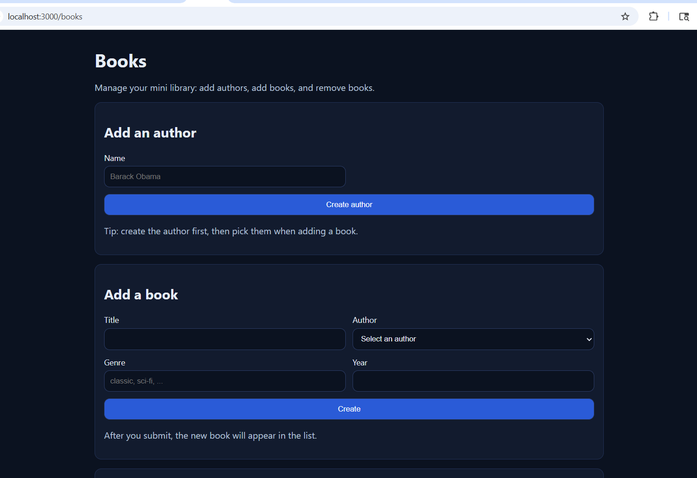
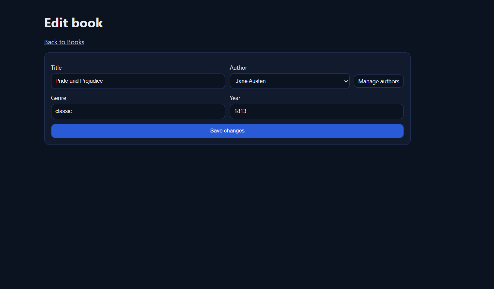
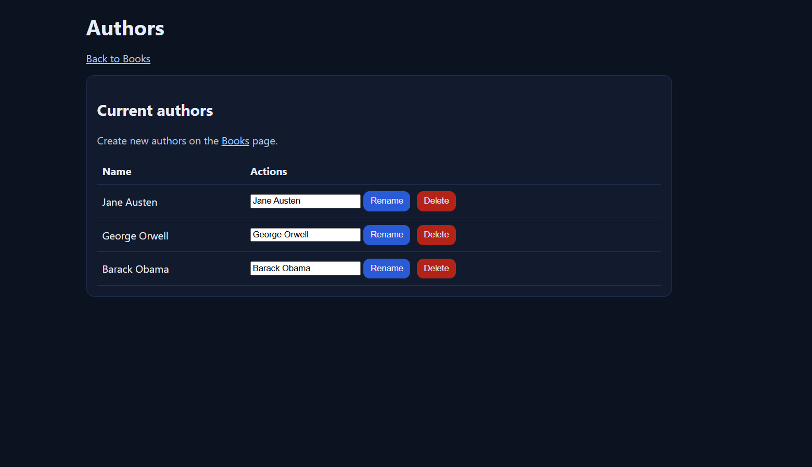

# SBA 318 Express Server Application (Mini Library)

Small Express app with:

- A REST API (`/api/*`)
- A server-rendered page (`/books`) using EJS
- Forms that interact with the API (create author + create book)

## Setup

```bash
npm install
```

## Run

Dev (auto-reload):

```bash
npm run dev
```

Production:

```bash
npm start
```

Server starts on `http://localhost:3000`.

## Pages

- `GET /books` — Books page (EJS). Includes:
  - Add author form (POSTs to `/api/authors`)
  - Add book form (POSTs to `/api/books`)
  - Delete book button (POSTs to `/books/:bookId/delete`)
- `GET /books/:bookId/edit` — Edit a book (two-step form)
- `GET /authors` — Manage authors (rename/delete)

## Demo flow (quick test)

1. Open `http://localhost:3000/books`
2. Create a new author (e.g., “Barack Obama”)
3. Add a new book and select the author you just created
4. Click **Edit** on a book and change the title or genre
5. Click **Delete** on a book you want to remove

## API endpoints

### Health

- `GET /health`

### Books

- `GET /api/books` — list books
  - Query params:
    - `genre`
    - `authorId`
    - `q` (search title)
- `GET /api/books/:bookId` — book detail
- `POST /api/books` — create a book
- `PATCH /api/books/:bookId` — edit a book
- `DELETE /api/books/:bookId` — delete a book

### Authors

- `GET /api/authors` — list authors
- `GET /api/authors/:authorId` — author detail
- `POST /api/authors` — create an author

### Reviews

- `GET /api/reviews` — list reviews
- `GET /api/reviews/:reviewId` — review detail

## Notes

- Data is stored in memory (arrays). Restarting the server resets data.

## Screenshots

Add your screenshots in a `screenshots/` folder and update the paths below:

```







```
